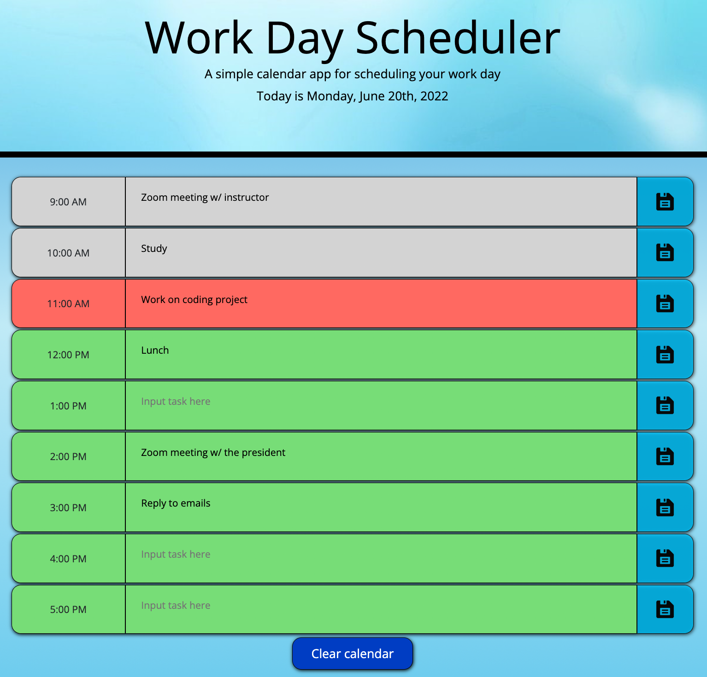

# Work-Day-Scheduler
A simple application that allows users to save events for every hour throughout the day.

## Overview
The purpose of this project was to create a dynamically generated, responsive, work-day scheduler that allows the user to input text, save it, and keep the contents after refreshing the page. This was accomplished with the use of [jQuery](https://jquery.com/), [BootStrap](https://getbootstrap.com/), and [Moment.js](https://momentjs.com/).

The user simply has to write a task within a text field, hit the save icon, and their text will be saved into localStorage. This can be done for any of the hours listed and can be reset by pressing the "Reset calendar" button at the bottom of the page.

The rows also change color depending on what hour of the day it is. If the hour is in the past, it is white. If the hour is in the future, it is green. And if the current hour is on the calendar then it is red.

## What it looks like

## The live page
The live page can be found by clicking [here.](https://tonyq032.github.io/Work-Day-Scheduler/) 